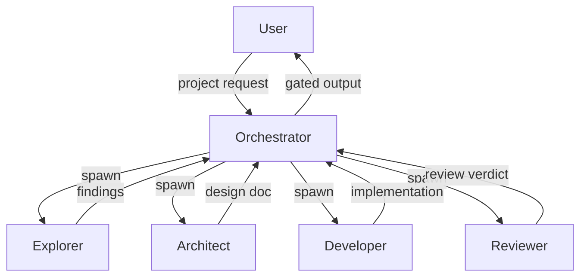
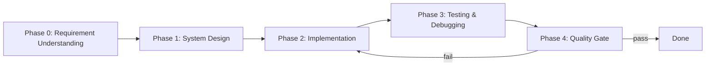
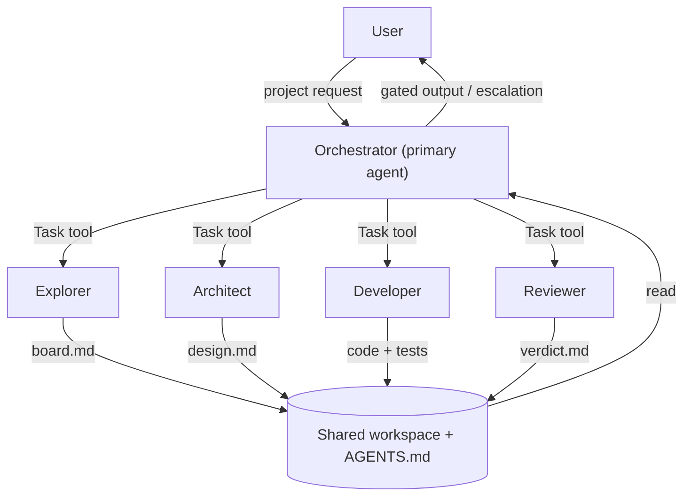

# Multi-Agent Experiment Suggestions

## 1. Executive Summary

This is an experiment to test multi-agent patterns for end-to-end agentic project delivery (requirement analysis → design → implement/test/debug → quality gating), using **OpenCode** as the execution engine.

The experiment should define agent roles, workflow orchestration, and document-based coordination patterns that can be applied when running projects through OpenCode.

**Accurate capability framing:** OpenCode supports **configurable primary agents + invokable subagents (via the Task tool)**. It does *not* ship a built-in orchestration runtime. The orchestration logic (phase flow, gating, escalation) lives in agent prompts and shared documents — not in an external wrapper. This design encodes that logic into a `primary` Orchestrator agent and a set of `subagent` workers.

---

## 2. Recommended Architecture

### 2.1 High-Level Design



### 2.2 Core Concept: OpenCode as Execution Engine

OpenCode supports configurable **primary agents** (the agent you converse with) and **subagents** (invoked by a primary agent via the Task tool, or by the user via `@mention`). Each "agent" in our experiment is an OpenCode agent definition with:
- A `description` (required), `mode` (`primary` | `subagent`), and `model`
- A `permission` block gating tools (`edit`, `bash`, `read`, `task`, `webfetch`, ...)
- A system `prompt` defining its role
- Access to project files via the shared workspace
- Cross-agent coordination via shared document files (boards) and project `AGENTS.md`

**Native multi-agent pattern:** A `primary` Orchestrator invokes `subagent` workers through the **Task tool**. Which subagents an agent may invoke is scoped via `permission.task`. We do **not** spawn separate processes or sessions via `opencode run`/`serve` for delegation — that fights the platform. The Orchestrator is a long-lived primary session; workers are short-lived Task invocations that read/write board files in the shared workspace.

**Key insight:** The experiment's value is in **defining the agent roles, prompts, permissions, and workflow documents** that drive OpenCode execution, not in building new infrastructure.

---

## 3. Agent Role Definitions

### 3.1 Orchestrator (Lead Agent)

**Role:** The conductor. Communicates with the user, decomposes tasks, spawns workers, reviews outputs, and gates progress.

**Config:**
- `mode: primary`
- `description: "Lead agent: plans, delegates to subagents via Task tool, gates quality, escalates to user"`
- `model: anthropic/claude-sonnet-4-20250514` (strong reasoning model)
- `permission: { edit: ask, bash: ask, task: { "*": "deny", "architect": "allow", "developer": "allow", "reviewer": "allow", "explorer": "allow" } }`
- `steps: 40` (cap to prevent runaway loops; orchestrator escalates to user when exhausted)

**System Prompt:**
```
You are the Orchestrator for a multi-agent software project.
Your responsibilities:
1. Understand and clarify user requirements
2. Decompose the project into phases: Requirements → Design → Implementation → Review
3. Delegate work to specialized subagents via the Task tool (architect, developer, reviewer, explorer).
   You may ONLY invoke these subagents — do not attempt implementation yourself.
4. Review all outputs against project goals and original requirements
5. Control the implement/refine → review cycle (max 3 review iterations per task)
6. Maintain the project board (boards/orchestrator/<project>/board.md)
7. After max review iterations without approval, STOP and escalate to the user with a summary.

Communication style: Clear, structured, decisive.
Output format: Always update the project board before delegating to the next subagent.
```

### 3.2 Explorer (Quick Actioner)

**Role:** Information gathering, code inspection, small research tasks. Supports other agents by handling lightweight work.

**Note on built-in:** OpenCode ships a built-in `explore` subagent (read-only codebase scout). We keep a project-level `explorer` definition to make the agent set complete and self-documenting, but its definition is **adapted from the built-in `explore`** (copied into `.opencode/agents/explorer.md` and extended with web-research permissions). This keeps the project self-contained while staying aligned with OpenCode conventions.

**Config:**
- `mode: subagent`
- `description: "Quick read-only research: codebase inspection, web lookup, small fact-finding tasks"`
- `model: anthropic/claude-haiku-4-20250514` (fast/cheap)
- `permission: { edit: deny, bash: deny, webfetch: allow, websearch: allow }`
- `steps: 5` (cap cost; this agent must stay focused)

**System Prompt:**
```
You are the Explorer agent. Your job is quick, focused information gathering:
- Search the web for relevant information
- Inspect code repositories and file structures
- Collect references and precedents
- Report findings concisely with file paths and URLs

Constraints:
- Do NOT write implementation code
- Do NOT make architectural decisions
- Keep findings factual and source-attributed
- You have a small step budget — stay on task
```

### 3.3 Architect (System Designer)

**Role:** Deep analysis, system design, architecture decisions. No coding or testing.

**Config:**
- `mode: subagent`
- `description: "System design and analysis; produces design docs; no code"`
- `model: anthropic/claude-sonnet-4-20250514` (reasoning-heavy)
- `permission: { edit: allow, bash: deny }` (may write design.md; no shell)
- `temperature: 0.2` (focused, deterministic design work)

**System Prompt:**
```
You are the Architect agent. Your responsibilities:
1. Analyze requirements and existing codebase
2. Design system architecture (components, interfaces, data flow)
3. Identify technical risks and mitigation strategies
4. Produce a design document (design.md) with:
   - System overview
   - Component diagram (textual)
   - API/interface specifications
   - Data models
   - Technology choices with rationale
5. Apply first principles in the analysis and design

Constraints:
- Do NOT write implementation code
- Do NOT run tests or shell commands
- Focus on "what" and "why", not "how to code it"
- Design must be reviewable by the Reviewer agent
```

### 3.4 Developer (Implementer)

**Role:** Implementation, testing, debugging. The hands-on coder.

**Config:**
- `mode: subagent`
- `description: "Implementation, tests, debugging; works against design doc"`
- `model: opencode/gpt-5.1-codex` (code-specialized; adjust per available providers)
- `permission: { edit: allow, bash: allow, webfetch: allow }`
- `steps: 30` (cap to keep tasks bounded; orchestrator re-delegates if more needed)

**System Prompt:**
```
You are the Developer agent. Your responsibilities:
1. Implement features according to design documents
2. Write unit and integration tests
3. Debug and fix issues
4. Run tests and verify fixes

Execution approach:
- Work within the project's existing codebase
- Follow the design document specifications
- Report progress to the project board (boards/developer/<task_id>/board.md)

Constraints:
- Do NOT change architecture without Architect approval (flag for orchestrator)
- Do NOT skip tests
- All changes must be traceable to design requirements
```

### 3.5 Reviewer (Quality Gate)

**Role:** Skeptical reviewer for all outputs. System-level view. Master of quality assurance.

**Config:**
- `mode: subagent`
- `description: "Skeptical quality gate for all stage outputs; APPROVED / NEEDS_REVISION verdict"`
- `model: anthropic/claude-sonnet-4-20250514` (reasoning-heavy)
- `permission: { edit: deny, bash: deny, webfetch: allow }` (read-only gate)
- `temperature: 0.1` (consistent, conservative judgments)

**System Prompt:**
```
You are the Reviewer agent. Your responsibilities:
1. Review all stage outputs against:
   - Original project goals and requirements
   - Current stage objectives
   - Quality standards (correctness, completeness, consistency)
2. For each review, check:
   - Does the output match the planned task goal?
   - Does the current stage align with the project goal?
   - Are original custom requirements/key concerns addressed?
3. Produce a review verdict: APPROVED / NEEDS_REVISION with specific feedback

Review criteria by stage:
- Requirements: Completeness, clarity, testability
- Design: Feasibility, consistency, scalability
- Implementation: Correctness, test coverage, code quality
- Tests: Coverage, edge cases, reliability

Constraints:
- Be skeptical and thorough
- Provide specific, actionable feedback
- Do NOT approve incomplete or misaligned work
- You cannot edit files or run shell commands — verdicts only
```

---

## 4. Workflow Design

### 4.1 Phase Structure



### 4.2 Document-Based Coordination

All cross-agent coordination happens through **board documents** in the workspace, plus a project `AGENTS.md` that is auto-loaded into every agent's context (OpenCode reads it automatically — no need to instruct agents to read it).

**Use `AGENTS.md` for:** stable cross-agent conventions (board layout, naming, escalation policy, where to write outputs). Every agent sees it for free.
**Use `boards/` for:** per-project, per-task dynamic state that changes during a run.

```
<root-dir>/                       # the experiment repo root
├── AGENTS.md                     # Cross-agent conventions (auto-loaded by all agents)
├── boards/
│   ├── orchestrator/
│   │   └── <project_name>/
│   │       └── board.md          # Master project board
│   ├── explorer/
│   │   └── <task_id>/
│   │       └── board.md          # Explorer findings
│   ├── architect/
│   │   └── <task_id>/
│   │       └── board.md          # Design documents
│   ├── developer/
│   │   └── <task_id>/
│   │       └── board.md          # Implementation progress
│   └── reviewer/
│       └── <task_id>/
│           └── board.md          # Review verdicts
├── task/
│   └── coord.md                  # Coordination log (optional; AGENTS.md covers most)
└── memory/
    └── knowledge/                # Extracted insights
```

> `<root-dir>` is a placeholder for wherever the experiment repo lives (in this checkout it is `ateam/`). Do not hardcode the directory name in prompts or docs — reference it generically.

### 4.3 Implement/Refine → Review Cycle

```
1. Orchestrator defines task and delegates to Developer via Task tool
2. Developer works on task (bounded by its `steps` cap)
3. Developer updates its task board with progress
4. Orchestrator delegates to Reviewer via Task tool
5. Reviewer evaluates output against:
   - Task goal
   - Project goals
   - Original requirements
6. Reviewer writes verdict (APPROVED / NEEDS_REVISION) to its task board
7. If APPROVED → Orchestrator proceeds to next phase
8. If NEEDS_REVISION → Orchestrator re-delegates to Developer with the Reviewer's feedback
9. Loop back to step 2. After MAX_REVIEW_ITERATIONS (default 3) without APPROVED:
   → Orchestrator STOPS and escalates to the user with:
     - summary of what was attempted
     - the Reviewer's last feedback
     - a recommended path forward
```

The `MAX_REVIEW_ITERATIONS` cap and escalation policy are encoded in the Orchestrator prompt and mirrored in `AGENTS.md` so all agents share the same rule.

---

## 5. OpenCode Integration Strategy

### 5.1 OpenCode Agent Configuration

OpenCode agents are configured under the **`agent`** (singular) key in `opencode.json`, or as markdown files under `.opencode/agents/`. Each agent requires a `description` and a `mode` (`primary` | `subagent`). Tool access is gated via the `permission` block, and which subagents an agent may invoke is scoped via `permission.task`.

Recommended config (markdown form is equally valid; see §6.1 for file layout):

```jsonc
{
  "$schema": "https://opencode.ai/config.json",
  "agent": {
    "orchestrator": {
      "description": "Lead agent: plans, delegates to subagents via Task tool, gates quality, escalates to user",
      "mode": "primary",
      "model": "anthropic/claude-sonnet-4-20250514",
      "steps": 40,
      "permission": {
        "edit": "ask",
        "bash": "ask",
        "task": {
          "*": "deny",
          "architect": "allow",
          "developer": "allow",
          "reviewer": "allow",
          "explorer": "allow"
        }
      },
      "prompt": "{file:./.opencode/prompts/orchestrator.md}"
    },
    "architect": {
      "description": "System design and analysis; produces design docs; no code",
      "mode": "subagent",
      "model": "anthropic/claude-sonnet-4-20250514",
      "temperature": 0.2,
      "permission": { "edit": "allow", "bash": "deny" },
      "prompt": "{file:./.opencode/prompts/architect.md}"
    },
    "developer": {
      "description": "Implementation, tests, debugging; works against design doc",
      "mode": "subagent",
      "model": "opencode/gpt-5.1-codex",
      "steps": 30,
      "permission": { "edit": "allow", "bash": "allow", "webfetch": "allow" },
      "prompt": "{file:./.opencode/prompts/developer.md}"
    },
    "reviewer": {
      "description": "Skeptical quality gate for all stage outputs; APPROVED / NEEDS_REVISION verdict",
      "mode": "subagent",
      "model": "anthropic/claude-sonnet-4-20250514",
      "temperature": 0.1,
      "permission": { "edit": "deny", "bash": "deny", "webfetch": "allow" },
      "prompt": "{file:./.opencode/prompts/reviewer.md}"
    },
    "explorer": {
      "description": "Quick read-only research: codebase inspection, web lookup, small fact-finding tasks",
      "mode": "subagent",
      "model": "anthropic/claude-haiku-4-20250514",
      "steps": 5,
      "permission": { "edit": "deny", "bash": "deny", "webfetch": "allow", "websearch": "allow" },
      "prompt": "{file:./.opencode/prompts/explorer.md}"
    }
  }
}
```

> Model IDs are illustrative — run `opencode models` to confirm available IDs for your configured providers before finalizing.

### 5.2 Delegation Model

- The **Orchestrator is the only `primary` agent** in this experiment; the user converses with it directly.
- All workers (architect, developer, reviewer, explorer) are `subagent`s invoked by the Orchestrator via the **Task tool**. Users may also `@mention` them directly for ad-hoc work.
- `permission.task` on the Orchestrator denies `*` and explicitly allows the four worker subagents — this is OpenCode's native mechanism for the "leader + workers" pattern and prevents the model from invoking unintended agents.
- Workers share the same workspace directory; coordination is file-based via boards + `AGENTS.md`. No separate process spawning, no `opencode run`/`serve` orchestration layer is needed.
- Long-running orchestrator context can be managed with OpenCode's built-in `/compact` when it grows large.

---

## 6. Implementation Plan

### 6.1 File Structure

```
<root-dir>/
├── prj_goal.md                      # Existing project goal
├── design.md                        # This document
├── AGENTS.md                        # Cross-agent conventions (auto-loaded by all agents)
├── README.md                        # Experiment overview
├── .opencode/
│   ├── config.json                  # OpenCode project config (or opencode.json at root)
│   ├── agents/
│   │   ├── orchestrator.md          # (alt) markdown-form agent definitions
│   │   ├── explorer.md              #   adapted from built-in `explore`
│   │   ├── architect.md
│   │   ├── developer.md
│   │   └── reviewer.md
│   └── prompts/
│       ├── orchestrator.md          # System prompts referenced by config
│       ├── explorer.md
│       ├── architect.md
│       ├── developer.md
│       └── reviewer.md
├── workflow/
│   ├── phases.md                    # Phase definitions
│   ├── coordination.md              # Document-based coordination rules
│   └── review_cycle.md              # Implement/refine → review cycle
├── templates/
│   ├── project_board.md             # Master board template
│   ├── design_doc.md                # Design document template
│   ├── review_verdict.md            # Review verdict template
│   └── task_board.md                # Task board template
├── boards/                          # Runtime state (created during a run)
│   └── ...                          #   see §4.2 layout
└── examples/
    └── sample_project.md            # Example run-through
```

> Agent definitions can live either as JSON in `.opencode/config.json` (the `agent` key) or as markdown files in `.opencode/agents/`. Pick one form to avoid duplication. The `agents/` top-level directory in the earlier draft is moved under `.opencode/` to match OpenCode's convention.

### 6.2 Implementation Steps

1. **Define agent prompts** in `.opencode/agents/*.md` (or the `agent` key in `opencode.json`)
2. **Write `AGENTS.md`** with cross-agent conventions (board layout, naming, `MAX_REVIEW_ITERATIONS`, escalation policy)
3. **Create workflow documents** in `workflow/`
4. **Create board templates** in `templates/`
5. **Run the POC** (see §10.1) — one project, Phase 0+1, Orchestrator + Architect + Reviewer
6. **Extend to full pipeline** — add Developer + Explorer, wire the implement/refine → review loop
7. **Document results** in `examples/`

---

## 7. Key Design Decisions

| Decision | Rationale |
|----------|-----------|
| **Orchestrator is the only `primary` agent** | Matches OpenCode's primary/subagent model; one entry point for the user |
| **Workers are `subagent`s invoked via Task tool** | Native OpenCode delegation; no external process spawning needed |
| **`permission.task` scopes delegation** | OpenCode's built-in mechanism for the "leader + workers" pattern; prevents unintended agent invocations |
| **Document-based coordination via boards** | Explicit, auditable, works across async Task invocations |
| **`AGENTS.md` for stable conventions** | Auto-loaded into every agent's context — no need to instruct agents to read it |
| **Reviewer as gatekeeper (read-only)** | Ensures quality at each stage; cannot edit files, so verdicts stay unbiased |
| **`steps` caps on every agent** | Bounds cost and prevents runaway loops; orchestrator escalates to user when exhausted |
| **Max 3 review iterations → escalate to user** | Prevents endless implement/refine loops; surfaces stuck work to the human |
| **Explorer adapted from built-in `explore`** | Keeps the agent set complete and self-documenting while staying conventional |
| **Orchestration logic in prompts/docs, not a wrapper script** | OpenCode has no orchestration runtime; encoding it in the Orchestrator prompt + `AGENTS.md` is the idiomatic path |

---

## 8. Open Questions for Discussion

1. **Model assignments** — Stronger reasoning models for Architect/Reviewer/Orchestrator, code-specialized for Developer, fast/cheap for Explorer? Confirm available IDs via `opencode models` before finalizing.
2. **User interaction during the workflow** — Checkpoints at each phase for user confirmation? Continuous updates via the orchestrator's replies? User may intervene at any time via the primary session?
3. **What should the experiment measure?** Time to complete a sample project; quality of outputs at each stage; token/cost efficiency; success rate of review cycles (iterations-to-approval).
4. **POC scope first?** See §10 — start with Phase 0+1 only (requirements → design) before adding Developer/Explorer.

---

## 9. OpenCode Official Multi-Agent Mechanisms & Alignment Review

### 9.1 What OpenCode Actually Provides

Based on official docs (`https://opencode.ai/docs/agents/`):

| Mechanism | Status | Notes |
|-----------|--------|-------|
| **Config-driven agents** | Supported | `agent` key in `opencode.json`, or `.opencode/agents/<name>.md` with YAML frontmatter |
| **Primary agents** | Supported | The main conversational agent; switchable via `Tab`. Built-ins: `build`, `plan` |
| **Subagents** | Supported | Invoked by primaries via the **Task tool**, or by users via `@mention`. Built-ins: `general`, `explore`, `scout` |
| **`permission.task` scoping** | Supported | Glob-pattern rules for which subagents an agent may invoke — the native "leader + workers" mechanism |
| **Per-agent model / temperature / steps** | Supported | `model`, `temperature`, `steps` (max agentic iterations) per agent |
| **Fine-grained permissions** | Supported | `permission` block: `edit`, `bash`, `read`, `webfetch`, `websearch`, `task`, ... (with glob patterns for bash) |
| **Shared project context** | Supported | `AGENTS.md` auto-loaded into every agent's context; `.opencode/rules/` for additional rules |
| **Context compaction** | Supported | `/compact` for long sessions; built-in `compaction` agent |
| **MCP integration** | Supported | Attach MCP servers for tool expansion |
| **Built-in orchestration runtime** | **Not provided** | No phase loop, no review gating, no escalation. Orchestration logic must live in prompts + shared docs |

**Key finding:** OpenCode's "multi-agent" support is **configurable agents + invokable subagents via the Task tool**, not a built-in workflow runtime. The orchestration patterns in this design are encoded in the Orchestrator's prompt and `AGENTS.md` — not implemented as an external wrapper.

### 9.2 Alignment Analysis

| Design Aspect | OpenCode Convention | Current Design | Alignment |
|---------------|---------------------|----------------|-----------|
| **Agent definition** | `agent` key in `opencode.json` or `.opencode/agents/<name>.md` | `.opencode/agents/*.md` + `opencode.json` | ✅ Aligned |
| **Primary vs subagent** | `mode: primary` / `subagent` | Orchestrator=primary; workers=subagent | ✅ Aligned |
| **Required `description`** | Required field | Added to every agent | ✅ Aligned |
| **Tool access** | `permission` block (`edit`/`bash`/`webfetch`/...) | Per-agent `permission` blocks | ✅ Aligned |
| **Leader→worker scoping** | `permission.task` glob rules | Orchestrator denies `*`, allows 4 workers | ✅ Aligned |
| **Cross-agent communication** | Shared workspace files + `AGENTS.md` | Board documents + `AGENTS.md` | ✅ Aligned |
| **Workflow orchestration** | Not built-in | Encoded in Orchestrator prompt + `AGENTS.md` | ✅ Aligned (custom layer is prompt-level, not a script) |
| **Context management** | `/compact`, `compaction` agent | Noted for long orchestrator sessions | ✅ Aligned |
| **Quality gating** | Not built-in | Reviewer subagent + verdict docs | ✅ Aligned (prompt-level) |

### 9.3 Leveraged OpenCode Features

1. **Native agent config format** — `.opencode/agents/*.md` with YAML frontmatter, or the `agent` key in `opencode.json`.
2. **Task-tool delegation** — Orchestrator invokes workers via Task tool; no external process spawning.
3. **`permission.task` scoping** — declares exactly which workers the Orchestrator may invoke.
4. **`AGENTS.md`** — auto-loaded into every agent; carries stable cross-agent conventions (board layout, escalation policy).
5. **`/compact`** — manage long orchestrator context mid-run.
6. **Built-in `explore`** — the project `explorer` is adapted from this built-in to keep the agent set complete while staying conventional.
7. **MCP servers** — optional tool expansion (e.g., a board-management MCP) if the experiment later needs it.
8. **`/undo`** — safe experimentation during the POC.

### 9.4 Architecture (Final)



**Design choice:** The Orchestrator is a long-lived `primary` agent that delegates to `subagent` workers via the Task tool. Workers read/write board files in the shared workspace; the Orchestrator reads them to coordinate and gate. No `opencode run`/`serve` wrapper, no session forking for delegation — these fight the platform.

---

## 10. Next Steps

### 10.1 Minimal Proof-of-Concept (do this first)

Scope the POC narrowly to validate the doc-based gating pattern before building the full pipeline:

- **Scope:** one small project (e.g., a tiny CLI tool), **Phase 0 + Phase 1 only** (Requirements → Design).
- **Agents involved:** Orchestrator + Architect + Reviewer. (Skip Developer and Explorer for the POC.)
- **Flow:** Orchestrator clarifies requirement → delegates design to Architect → Architect writes `design.md` → Orchestrator delegates review to Reviewer → Reviewer writes verdict → Orchestrator gates (approve or re-delegate).
- **Single review cycle** in the POC (no multi-iteration loop yet).
- **Deliverable:** a runnable OpenCode config + prompts + one completed sample `design.md` + reviewer verdict, plus notes on what worked and what broke.

### 10.2 Full Build-Out (after POC validates)

1. Define detailed agent prompts in `.opencode/agents/*.md` (or `opencode.json` `agent` key).
2. Write `AGENTS.md` with cross-agent conventions (board layout, naming, `MAX_REVIEW_ITERATIONS`, escalation policy).
3. Create board templates in `templates/`.
4. Add Developer and Explorer; wire the full implement/refine → review loop.
5. Run an end-to-end sample project; document findings in `examples/`.
