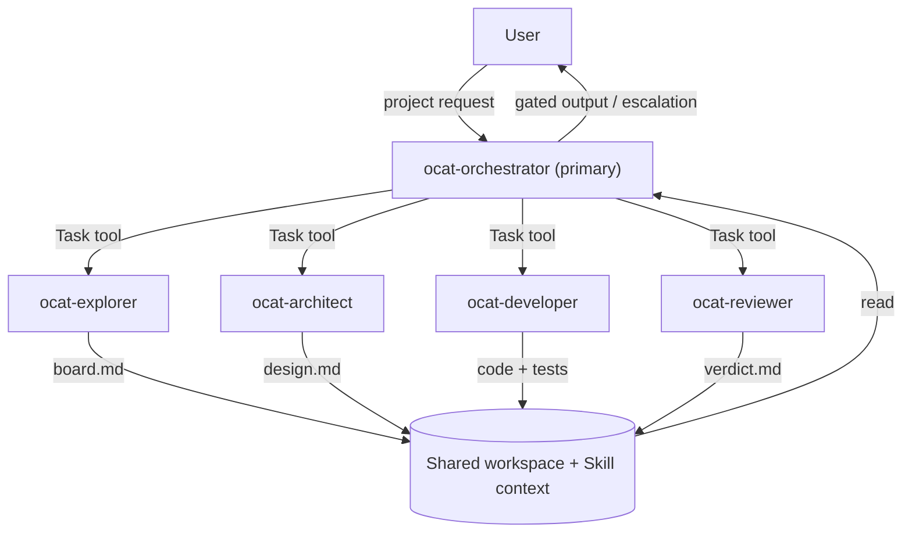
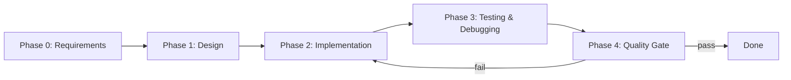

# OCATeam — Multi-Agent Project Delivery Framework

## 1. Executive Summary

OCATeam is a reusable multi-agent framework for end-to-end agentic project delivery (requirement analysis → design → implement/test/debug → quality gating), built on **OpenCode** as the execution engine.

The framework defines agent roles, workflow orchestration, document-based coordination patterns, and an installation/distribution mechanism that makes it trivially reusable across projects.

**Key insight:** OpenCode supports configurable primary agents + invokable subagents (via the Task tool) but does not ship a built-in orchestration runtime. OCATeam encodes the orchestration logic into a `primary` Orchestrator agent, a set of `subagent` workers, and a Skill that provides the full workflow context.

---

## 2. Architecture

### 2.1 High-Level Design



### 2.2 Core Concept: OpenCode as Execution Engine

- **Primary agent**: `ocat-orchestrator` — the user converses with it directly; it plans, delegates, and gates
- **Subagents**: `ocat-architect`, `ocat-developer`, `ocat-reviewer`, `ocat-explorer` — invoked by the orchestrator via the Task tool, or by the user via `@mention`
- **Skill**: `ocat` — loaded on-demand by the orchestrator; provides the full workflow context (phases, coordination rules, board templates, escalation policy)
- **Coordination**: Document-based via board files in `.boards/` directory
- **No external wrapper**: All orchestration lives in agent prompts and the Skill — no `opencode run`/`serve` wrapper

### 2.3 Agent Set

| Agent | Mode | Purpose | Can Edit | Can Bash |
|-------|------|---------|----------|----------|
| `ocat-orchestrator` | primary | Plan, delegate, gate, escalate | ask | ask |
| `ocat-architect` | subagent | System design, no code | allow | deny |
| `ocat-developer` | subagent | Implementation + tests | allow | allow |
| `ocat-reviewer` | subagent | Quality gate, read-only | deny | deny |
| `ocat-explorer` | subagent | Research, inspection | deny | deny |

---

## 3. Distribution & Consumption Strategy

### 3.1 Design Goals

| Goal | Approach |
|------|----------|
| **Zero setup per project** | Global install (`~/.config/opencode/`) makes agents available everywhere |
| **Project-committed customization** | Per-project install (`.opencode/.agents/`) for team-shared, version-controlled config |
| **Flexible activation** | `.ocat.json` in project root controls which subagents the orchestrator may delegate to |
| **Overridable defaults** | Sensible default models in agent definitions; users override in `opencode.json` |
| **One-command install** | `install.sh` supports both global and per-project modes |

### 3.2 Two Install Modes

**Global mode** — agents + skill available in ALL projects:
```bash
./install.sh --global
# Copies agents → ~/.config/opencode/agents/ocat-*.md
# Copies skill  → ~/.config/opencode/skills/ocat/SKILL.md
```
After install: open any project, `Tab` → `ocat-orchestrator`, describe your project. Zero per-project files needed.

**Per-project mode** — agents + skill committed to a specific project:
```bash
./install.sh --project ~/code/my-app
# Copies agents → my-app/.opencode/.agents/ocat-*.md
# Copies skill  → my-app/.opencode/.skills/ocat/SKILL.md
# Scaffolds     → my-app/opencode.json (minimal, if absent)
# Scaffolds     → my-app/.ocat.json (OCATeam active agents config, if absent)
```
Team shares the agent config via git; customize per project.

### 3.3 Per-Project Activation

Inside a project's `.ocat.json`:
```json
{
  "active_agents": ["architect", "developer", "reviewer", "explorer"]
}
```
- The Orchestrator reads this file on startup and only delegates to agents present in the list
- Remove entries to deactivate agents not needed for the project
- If absent, all agents in the orchestrator's `permission.task` allowlist are active

### 3.4 Model Overrides

Sensible defaults are provided. Override in `opencode.json`:
```json
{
  "agent": {
    "ocat-developer": { "model": "openai/gpt-5" }
  }
}
```

### 3.5 Consumption UX

```
# One-time setup:
cd ocateam && ./install.sh --global

# Every new project thereafter:
opencode my-project/
# Tab → "ocat-orchestrator"
# Type: "Start a new project: <description>"
# Orchestrator loads the ocat skill and runs Phase 0 → 4
```

### 3.6 Configuration Mechanism

OCATeam uses two configuration files at the project root, each with a distinct role:

| File | Purpose | Created by | Schema |
|------|---------|-----------|--------|
| `.ocat.json` | OCATeam-specific: lists which subagents the orchestrator may delegate to | `install.sh --project` | Custom (no schema conflict) |
| `opencode.json` | OpenCode-native: model overrides, agent permissions, plugin config | `install.sh --project` (minimal) | OpenCode schema |

**Why separate files?** `opencode.json` is validated against OpenCode's schema, which rejects unknown keys. Placing OCATeam config under an `"ocat"` key in `opencode.json` causes OpenCode to fail with `Unrecognized key: ocateam`. A separate `.ocat.json` file avoids this conflict while keeping OCATeam config co-located with the project.

**Activation resolution order:**
1. Look for `<project>/.ocat.json`
2. If found → read `active_agents` array → intersect with orchestrator's `permission.task` allowlist
3. If not found or missing the key → all agents in the orchestrator's allowlist are active

**Global install behavior:** Global install (`--global`) never creates `.ocat.json` — all agents are unconditionally active, which is the desired default for zero-setup usage.

**Per-project install behavior:** Per-project install (`--project`) scaffolds both `.ocat.json` and `opencode.json` (if absent). Users edit `.ocat.json` to deactivate agents their project doesn't need.

---

## 4. Agent Role Definitions

### 4.1 Orchestrator (`ocat-orchestrator`)

**Role:** The conductor. Communicates with the user, decomposes tasks, spawns workers, reviews outputs, and gates progress.

**Config:**
- `mode: primary`
- `model: anthropic/claude-sonnet-4-20250514` (strong reasoning model; overridable)
- `steps: 200`
- `permission.task`: denies `*`, allows the four `ocat-*` workers

**Key behaviors:**
1. Load the ocat skill at session start for full workflow context
2. Read `.ocat.json` for `active_agents` to determine which subagents are active (falls back to all allowed if absent)
3. Maintain the master board: `.boards/orchestrator/<project>/board.md`
4. Control the implement/refine → review cycle (MAX_REVIEW_ITERATIONS = 3)
5. Escalate to user when stuck

### 4.2 Architect (`ocat-architect`)

**Role:** Deep system analysis and design. No coding or testing.

**Config:**
- `mode: subagent`
- `model: anthropic/claude-sonnet-4-20250514`
- `temperature: 0.2`
- `permission`: edit allow, bash deny

**Output:** Design document to `.boards/architect/<task_id>/board.md`

### 4.3 Developer (`ocat-developer`)

**Role:** Implementation, testing, debugging. The hands-on coder.

**Config:**
- `mode: subagent`
- `model: opencode/gpt-5.1-codex` (code-specialized)
- `steps: 30`
- `permission`: edit allow, bash allow, webfetch allow

**Output:** Code changes + test results in `.boards/developer/<task_id>/board.md`

### 4.4 Reviewer (`ocat-reviewer`)

**Role:** Skeptical quality gate for all stage outputs.

**Config:**
- `mode: subagent`
- `model: anthropic/claude-sonnet-4-20250514`
- `temperature: 0.1`
- `permission`: edit deny, bash deny, webfetch allow (read-only gate)

**Output:** Verdict (APPROVED / NEEDS_REVISION) in `.boards/reviewer/<task_id>/board.md`

### 4.5 Explorer (`ocat-explorer`)

**Role:** Quick, focused information gathering. Research, codebase inspection, fact-finding.

**Config:**
- `mode: subagent`
- `model: anthropic/claude-haiku-4-20250514` (fast/cheap)
- `steps: 5`
- `permission`: edit deny, bash deny, webfetch allow, websearch allow

**Output:** Findings in `.boards/explorer/<task_id>/board.md`

---

## 5. Workflow Design

### 5.1 Phase Structure



| Phase | Owner | Deliverable |
|-------|-------|-------------|
| 0: Requirements | Orchestrator (+ Explorer) | Clarified requirements in master board |
| 1: Design | Architect | Design document, reviewed by Reviewer |
| 2: Implementation | Developer | Code + tests, gated by Reviewer |
| 3: Testing & Debugging | Developer | Test results + fixes |
| 4: Quality Gate | Reviewer | Final verdict across all four review dimensions |

### 5.2 Implement/Refine → Review Cycle

```
1. Orchestrator defines task → delegates to Developer via Task tool
2. Developer implements + updates its task board
3. Orchestrator delegates to Reviewer via Task tool
4. Reviewer evaluates against four review dimensions:
   - **First-Principles Review**: question every element from fundamentals
   - **User-Value Alignment**: check deviation, omission, and over-engineering
   - **Requirement Traceability**: every output must trace to a user requirement
   - **Contamination Detection**: flag cross-project/platform elements
5. Reviewer writes verdict → APPROVED or NEEDS_REVISION
6. If APPROVED → proceed to next task/phase
7. If NEEDS_REVISION → re-delegate to Developer with Reviewer's feedback
8. Loop to step 2. After MAX_REVIEW_ITERATIONS (3) without APPROVED → escalate to user
```

### 5.3 Document-Based Coordination

All cross-agent coordination is document-based via board files:

```
.boards/
├── orchestrator/<project>/board.md     # Master board (phase progress, decisions)
├── architect/<task_id>/board.md        # Design documents
├── developer/<task_id>/board.md        # Implementation progress
├── reviewer/<task_id>/board.md         # Review verdicts
└── explorer/<task_id>/board.md         # Research findings
```

- The Orchestrator always updates the master board before delegating
- Subagents write outputs to their board file
- The Orchestrator reads board files to track progress and make decisions
- Board templates are defined in the ocat Skill

### 5.4 Escalation Policy

The Orchestrator escalates to the user when:
1. Review cycle exhausted (3 iterations without APPROVED)
2. Ambiguous requirements cannot be clarified
3. Architecture conflicts arise (Developer needs to diverge from design)
4. Agent step caps reached before completion
5. User interrupts at any time

---

## 6. Skill Design

The `ocat` skill (`skills/ocat/SKILL.md`) is the workflow intelligence layer — separate from agent role definitions. It contains:

- **Phase definitions**: Detailed descriptions of all 5 phases
- **Coordination rules**: Board file layout, naming conventions, communication conventions
- **Review cycle**: The implement/refine → review loop with MAX_REVIEW_ITERATIONS
- **Board templates**: Master board, task board, review verdict format
- **Escalation policy**: When and how to escalate
- **Activation config**: How `active_agents` in `.ocat.json` is read and respected

**Why a skill vs agent prompts:** The skill is loaded on-demand — it doesn't bloat every agent's context. The orchestrator loads it once at session start. It can be updated independently from agent role definitions. Users can even use the skill with built-in agents for lightweight use.

---

## 7. Key Design Decisions

| Decision | Rationale |
|----------|-----------|
| **`ocat-` prefix on agent names** | Avoids name collisions when installed globally alongside user's other agents |
| **Skill for workflow, agents for roles** | Separates "what to do" (skill) from "who does it" (agents); skill is independently updatable |
| **Two install modes (global + per-project)** | Global = zero-setup; per-project = team-committed, customizable |
| **`active_agents` list in `.ocat.json` for activation** | Simple UX — edit a list, not permission blocks; orchestrator reads and respects it. Separate from `opencode.json` to avoid schema conflicts with OpenCode's config validation. |
| **Sensible defaults + override** | Works out of the box; users override models in `opencode.json` |
| **Document-based coordination** | Explicit, auditable, works across async Task invocations |
| **Orchestrator is the only `primary` agent** | One entry point for the user; all workers are subagents |
| **Reviewer as read-only gatekeeper** | Cannot edit files, so verdicts stay unbiased |
| **`steps` caps on every agent** | Bounds cost; orchestrator escalates to user when exhausted |
| **MAX_REVIEW_ITERATIONS = 3 → escalate** | Prevents endless implement/refine loops |
| **OCATeam config in `.ocat.json`, OpenCode config in `opencode.json`** | Prevents schema validation conflicts; each file has a single owner. Discovered during Tier 3 POC testing when custom keys in `opencode.json` caused `Unrecognized key` errors. |
| **Orchestration in prompts + skill, not a wrapper script** | Idiomatic OpenCode usage; no external process spawning |
| **Hard confirmation gate after Phase 0** | Single mandatory checkpoint ensures requirements alignment before committing subagent resources; all other phases use soft constraints |
| **Dual-mode interaction strategy** | Plan Mode (Phase 0-1) ensures requirements alignment; Smart Mode (Phase 2-3) balances speed with quality via complexity-based confirmation |

---

## 8. Repository Structure

```
ocat/
├── doc/
│   ├── prj_goal.md                    # Original project goal
│   └── design.md                      # This document
├── agents/                            # Agent definition source files
│   ├── ocat-orchestrator.md
│   ├── ocat-architect.md
│   ├── ocat-developer.md
│   ├── ocat-reviewer.md
│   └── ocat-explorer.md
├── skills/
│   └── ocat/
│       └── SKILL.md                   # Workflow skill
├── scaffold/
│   ├── opencode.json.snippet          # Minimal per-project opencode config
│   └── ocat.json.snippet             # OCATeam active agents config
├── install.sh                         # One-command installer (global + per-project)
├── README.md                          # Project README (English)
└── README.zh-CN.md                    # Chinese translation
```

### Installation targets

| Source | Global target | Per-project target |
|--------|--------------|-------------------|
| `agents/*.md` | `~/.config/opencode/agents/` | `<project>/.opencode/.agents/` |
| `skills/ocat/SKILL.md` | `~/.config/opencode/skills/ocat/` | `<project>/.opencode/.skills/ocat/` |
| `scaffold/opencode.json.snippet` | N/A | `<project>/opencode.json` (if absent) |
| `scaffold/ocat.json.snippet` | N/A | `<project>/.ocat.json` (if absent) |

---

## 9. OpenCode Feature Alignment

| Design Aspect | OpenCode Mechanism | Status |
|---------------|-------------------|--------|
| Agent definition | `~/.config/opencode/agents/*.md` or `.opencode/.agents/*.md` | ✅ Aligned |
| Primary vs subagent | `mode: primary` / `subagent` | ✅ Aligned |
| Leader→worker scoping | `permission.task` glob rules | ✅ Aligned |
| Workflow context | Skill loaded via `skill` tool | ✅ Aligned |
| Cross-agent communication | Shared workspace files | ✅ Aligned |
| Context management | `/compact` for long sessions | ✅ Aligned |
| Model override | `agent.<name>.model` in `opencode.json` | ✅ Aligned |

---

## 10. Testing & Validation

### Completed
1. **Test global install**: ✅ Verified — `./install.sh --global`, agents appear in `~/.config/opencode/agents/`
2. **Test per-project install**: ✅ Verified — `./install.sh --project <test-project>`, scaffolding correct
3. **POC run Phase 0+1**: ✅ Verified — Orchestrator + Architect + Reviewer completed design review cycle
4. **Full pipeline**: ✅ Verified — All 5 phases (0-4) completed end-to-end on `hello-cli` test project
5. **Document results**: ✅ — See `tests/tier3_results.md`

### Automation
- **Tier 1 (static validation)**: `make validate` — 23 checks (YAML, JSON, bash, consistency)
- **Tier 2 (functional tests)**: `make install-test` — 17 bats test cases for install.sh behavior

### Deferred
- Review cycle NEEDS_REVISION path (requires deliberately ambiguous requirements)
- MAX_REVIEW_ITERATIONS exhaustion test (high cost)
- Active agents filtering test (manual verification needed)

---

## 11. Improvement Plan (v0.2.0)

Based on production usage experience and user feedback, the following improvements are planned for the next iteration.

### 11.1 Skill Trigger Mechanism

**Current Issue:**
The ocat skill relies on description-based matching to be recognized by the model. However, this is not reliable — if the user doesn't use specific keywords, the skill may not be triggered even when the intent is clear.

**Research Findings:**
According to OpenCode documentation, skills are loaded at session start (not dynamically triggered). The eligible skills are injected into the system prompt. The issue is that the agent may not know *when* to use the skill.

**Solution:**
1. **Agent-level trigger**: When the user switches to `ocat-orchestrator` (via Tab), the skill should be automatically loaded. The orchestrator prompt already instructs: "load it with `skill({ name: "ocat" })` at the start of each session."
2. **Explicit startup message**: Add a first-interaction prompt that informs the user about the multi-agent workflow mode and offers an opt-out.

**Implementation:**
- Update `ocat-orchestrator.md` to include explicit startup logic
- Add first-interaction detection and workflow mode announcement
- Test skill loading reliability across different user inputs

### 11.2 Hard Confirmation Gate After Phase 0

**Current Issue:**
The user confirmation gate after Phase 0 is currently a soft constraint (prompt-based). The orchestrator may skip it if it judges the requirements are clear enough.

**Decision:**
Implement a **hard confirmation gate** after Phase 0. This is the only mandatory confirmation in the entire workflow.

**Rationale:**
- Phase 0 is the planning phase — getting requirements wrong is costly
- A single hard gate provides quality assurance without impacting automation
- Other phases can use soft constraints (orchestrator judgment)

**Implementation:**
- Define a `confirm_with_user()` function in the skill
- Orchestrator MUST call this function after Phase 0 completion
- Cannot proceed to Phase 1 without explicit user approval
- Add structured confirmation format (requirements summary + implementation plan)

### 11.3 Dot-Prefixed Internal Directories

**Current Issue:**
Internal workflow directories (`boards/`, `agents/`, `skills/`, `ocat.json`) are not visually distinguished from project code.

**Decision:**
Rename all OCATeam-internal directories and files to use dot-prefix:
- `boards/` → `.boards/`
- `agents/` → `.agents/` (per-project install target)
- `skills/` → `.skills/` (per-project install target)
- `ocat.json` → `.ocat.json`

**Rationale:**
- Follows Unix convention for hidden/internal files (like `.git/`, `.vscode/`)
- Clearly distinguishes workflow infrastructure from project code
- Reduces cognitive load when browsing project structure

**Implementation:**
- Update `install.sh` and `install.ps1` to use new paths
- Update SKILL.md to reference new paths
- Update all tests
- Provide migration script for existing projects
- Update `.gitignore` templates

### 11.4 Structured Execution Log

**Current Issue:**
No comprehensive execution log exists. The boards track state, but not the full execution flow. Cannot audit:
- When each step started/ended
- How long each phase took
- Whether the workflow was followed correctly
- What the orchestrator was thinking at each step

**Decision:**
Implement **Option A: Structured execution log** in NDJSON format.

**Format:**
```json
{"ts":"2026-07-12T10:00:00Z","phase":0,"action":"start","agent":"ocat-orchestrator","msg":"开始需求分析"}
{"ts":"2026-07-12T10:05:00Z","phase":0,"action":"ask_user","agent":"ocat-orchestrator","msg":"询问认证方式偏好"}
{"ts":"2026-07-12T10:06:00Z","phase":0,"action":"user_response","agent":"user","msg":"选择 JWT"}
{"ts":"2026-07-12T10:10:00Z","phase":0,"action":"confirm","agent":"ocat-orchestrator","msg":"需求确认完成，进入设计阶段"}
```

**Location:**
`.boards/execution.log` (inside the dot-prefixed boards directory)

**Benefits:**
- Full audit trail of workflow execution
- Can replay workflow for debugging
- Can identify bottlenecks (which phases are slow?)
- Can verify workflow compliance
- Can generate metrics and reports

**Implementation:**
- Orchestrator writes to log at each step
- Subagents also log their actions
- Provide a viewer/analyzer tool (optional, can be simple `cat` or `jq`)
- Log rotation for long-running projects

### 11.5 Interaction Strategy: Plan Mode vs Smart Mode

**Current Issue:**
The workflow uses a uniform interaction style. Some phases need strict confirmation, others can be more autonomous.

**Decision:**
Implement a **dual-mode interaction strategy**:

**Phase 0-1 (Requirements & Design): Plan Mode**
- Strict confirmation at every key decision
- Requirements must be explicitly approved
- Design must be reviewed and approved
- No autonomous execution

**Phase 2-3 (Implementation & Testing): Smart Mode**
- Orchestrator judges when to ask for confirmation
- Simple tasks (< 30 min) → execute directly
- Medium tasks (30 min - 2 hr) → execute then report
- Complex tasks (> 2 hr) → confirm plan first
- Architecture changes → always confirm
- Multi-module changes → always confirm

**Implementation:**
- Add interaction strategy guidelines to SKILL.md
- Provide decision tree for when to confirm
- Allow project-level override in `.ocat.json`

### 11.6 Implementation Priority

| Priority | Improvement | Effort | Impact |
|----------|-------------|--------|--------|
| P0 | Hard confirmation gate | Low | High |
| P0 | Dot-prefixed directories | Medium | Medium |
| P1 | Skill trigger reliability | Medium | High |
| P1 | Execution log | High | High |
| P2 | Interaction strategy | Low | Medium |

**Recommended Order:**
1. Dot-prefixed directories (breaking change, do first)
2. Hard confirmation gate (quality improvement)
3. Skill trigger reliability (usability improvement)
4. Execution log (audit/debugging capability)
5. Interaction strategy (UX refinement)

### 11.7 Migration Strategy

For existing projects using OCATeam v0.1.x:

1. **Directory rename**: Provide `migrate.sh` script
   ```bash
   ./migrate.sh
   # Renames boards/ → .boards/, agents/ → .agents/, etc.
   # Updates .gitignore
   # Preserves all board content
   ```

2. **Backward compatibility**: Support both old and new paths for one version
   - Installers check for old paths and warn
   - Skill can read from both locations

3. **Version detection**: Add version to `.ocat.json`
   ```json
   {
     "version": "0.2.0",
     "active_agents": [...]
   }
   ```

### 11.8 Four-Dimension Review Framework

**Problem:** Subagent outputs can drift from project goals — introducing features that were not requested (over-engineering), omitting requested features, or importing concepts from unrelated platforms (ecosystem contamination). The OpenClaw incident (OpenClaw-specific metadata added to an OpenCode-only project) exposed this gap.

**Decision:**
Add four explicit review dimensions to the Reviewer agent and mandate them in every review:

1. **First-Principles Review** — Question every design decision and implementation from fundamentals. Does this element solve a real problem? Is it the simplest possible approach?
2. **User-Value Alignment** — Evaluate from the user's perspective. Check for: deviation from requirements, omission of requirements, over-engineering (features not asked for), and gold-plating (nice-to-haves that don't serve core goals).
3. **Requirement Traceability** — Every element in the output must trace back to a documented user requirement. Orphan elements without justification must be flagged.
4. **Contamination Detection** — Vigilantly check for cross-project or cross-platform elements: dependencies, API calls, or configurations from a different ecosystem than the project uses; hallucinated constraints never stated by the user; template/boilerplate remnants.

**Rationale:**
- Agents can hallucinate dependencies or confuse platforms (OpenCode vs OpenClaw)
- Without explicit traceability, subagents may add features the user never asked for
- The reviewer, as the final quality gate, is the best place to catch these issues
- Making these dimensions explicit (rather than implicit "check against requirements") forces the reviewer to engage critically with every element

**Implementation:**
- Update `agents/ocat-reviewer.md` with the four review dimensions and updated output format
- Update `skills/ocat/SKILL.md` review cycle and Phase 4 description
- Update `agents/ocat-orchestrator.md` Review & Gate responsibility
- Reviewers must report pass/fail for each dimension in their verdict

### 11.9 Agent-Level Thinking Configuration

**Problem:** OCATeam agents need appropriate thinking/reasoning depth for their roles (Architect/Developer/Reviewer need deep reasoning; Explorer needs lighter, faster responses). Without explicit configuration, all agents use the model's default thinking behavior, which may not be optimal for each role.

**Decision:**
Add a `thinking` field to each agent's frontmatter, documenting the intended thinking level:

| Agent | Thinking Level | Rationale |
|-------|---------------|-----------|
| ocat-orchestrator | high | Complex multi-agent coordination and quality gating |
| ocat-architect | high | Deep system analysis and architectural decisions |
| ocat-developer | high | Complex implementation, debugging, and test design |
| ocat-reviewer | high | Rigorous, skeptical review requiring deep analysis |
| ocat-explorer | medium | Quick, focused research — speed over depth |

**Implementation:**
1. Add `thinking: high` or `thinking: medium` to each agent's YAML frontmatter
2. Add a "Model Configuration" section to each agent's prompt explaining the thinking recommendation
3. Update `skills/ocat/SKILL.md` Agent Roles Summary table to include the Thinking column
4. Document the trade-off: `thinking` field is routed to `options.thinking` for forward compatibility; users who want to actually enable thinking must configure it in their `opencode.json` under `provider.<name>.models.<model>.options`

**Rationale:**
- Different OCATeam roles need different thinking depths — a single default doesn't fit all
- The frontmatter field declares intent without breaking existing OpenCode config (unknown fields are silently routed to `options`)
- Documenting in the prompt text means the agent itself can explain its thinking requirements when asked
- Users who want to actually enable thinking can follow the docs to configure their provider model options

---

## 12. Next Steps

After this design update is approved:

1. **Phase 0 (Plan)**: ✅ Complete (this document)
2. **Phase 1 (Design)**: ✅ Complete (this section)
3. **Phase 2 (Implementation)**: Delegate to ocat-developer
   - Task 1: Dot-prefixed directories
   - Task 2: Hard confirmation gate
   - Task 3: Skill trigger improvements
   - Task 4: Execution log
   - Task 5: Interaction strategy
4. **Phase 3 (Testing)**: Run full test suite, verify migration
5. **Phase 4 (Quality Gate)**: Final review against this design
