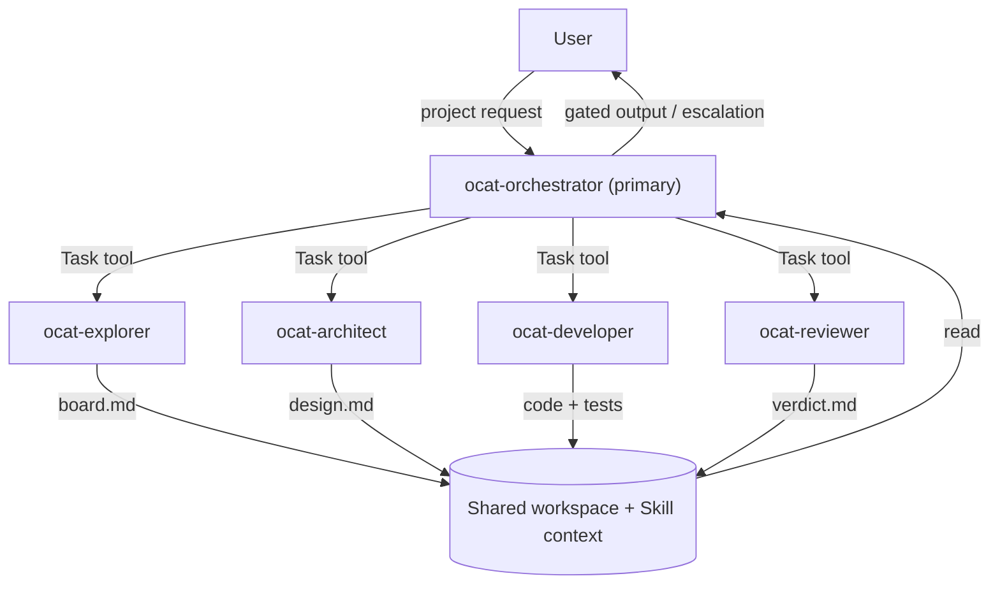
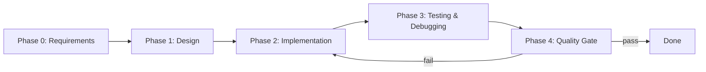

# OCATeam — Multi-Agent Project Delivery Framework

## 1. Executive Summary

OCATeam is a reusable multi-agent framework for end-to-end agentic project delivery (requirement analysis → design → implement/test/debug → quality gating), built on **OpenCode** as the execution engine.

The framework defines agent roles, workflow orchestration, document-based coordination patterns, and an installation/distribution mechanism that makes it trivially reusable across projects.

**Key insight:** OpenCode supports configurable primary agents + invokable subagents (via the Task tool) but does not ship a built-in orchestration runtime. OCATeam encodes the orchestration logic into a `primary` Orchestrator agent, a set of `subagent` workers, and a Skill that provides the full workflow context.

---

## 2. Architecture

### 2.1 High-Level Design



### 2.2 Core Concept: OpenCode as Execution Engine

- **Primary agent**: `ocat-orchestrator` — the user converses with it directly; it plans, delegates, and gates
- **Subagents**: `ocat-architect`, `ocat-developer`, `ocat-reviewer`, `ocat-explorer` — invoked by the orchestrator via the Task tool, or by the user via `@mention`
- **Skill**: `ocat` — loaded on-demand by the orchestrator; provides the full workflow context (phases, coordination rules, board templates, escalation policy)
- **Coordination**: Document-based via board files in `.boards/` directory
- **No external wrapper**: All orchestration lives in agent prompts and the Skill — no `opencode run`/`serve` wrapper

### 2.3 Agent Set

| Agent | Mode | Purpose | Can Edit | Can Bash |
|-------|------|---------|----------|----------|
| `ocat-orchestrator` | primary | Plan, delegate, gate, escalate | ask | ask |
| `ocat-architect` | subagent | System design, no code | allow | deny |
| `ocat-developer` | subagent | Implementation + tests | allow | allow |
| `ocat-reviewer` | subagent | Quality gate, read-only | deny | deny |
| `ocat-explorer` | subagent | Research, inspection | deny | deny |

---

## 3. Distribution & Consumption Strategy

### 3.1 Design Goals

| Goal | Approach |
|------|----------|
| **Zero setup per project** | Global install (`~/.config/opencode/`) makes agents available everywhere |
| **Project-committed customization** | Per-project install (`.opencode/agents/`) for team-shared, version-controlled config |
| **Flexible activation** | `.ocat.json` in project root controls which subagents the orchestrator may delegate to |
| **Overridable defaults** | Sensible default models in agent definitions; users override in `opencode.json` |
| **One-command install** | `install.sh` supports both global and per-project modes |

### 3.2 Two Install Modes

**Global mode** — agents + skill available in ALL projects:
```bash
./install.sh --global
# Copies agents → ~/.config/opencode/agents/ocat-*.md
# Copies skill  → ~/.config/opencode/skills/ocat/SKILL.md
```
After install: open any project, `Tab` → `ocat-orchestrator`, describe your project. Zero per-project files needed.

**Per-project mode** — agents + skill committed to a specific project:
```bash
./install.sh --project ~/code/my-app
# Copies agents → my-app/.opencode/agents/ocat-*.md
# Copies skill  → my-app/.opencode/skills/ocat/SKILL.md
# Scaffolds     → my-app/opencode.json (minimal, if absent)
# Scaffolds     → my-app/.ocat.json (OCATeam active agents config, if absent)
```
Team shares the agent config via git; customize per project.

### 3.3 Per-Project Activation

Inside a project's `.ocat.json`:
```json
{
  "active_agents": ["architect", "developer", "reviewer", "explorer"]
}
```
- The Orchestrator reads this file on startup and only delegates to agents present in the list
- Remove entries to deactivate agents not needed for the project
- If absent, all agents in the orchestrator's `permission.task` allowlist are active

### 3.4 Model Overrides

Sensible defaults are provided. Override in `opencode.json`:
```json
{
  "agent": {
    "ocat-developer": { "model": "openai/gpt-5" }
  }
}
```

### 3.5 Consumption UX

```
# One-time setup:
cd ocateam && ./install.sh --global

# Every new project thereafter:
opencode my-project/
# Tab → "ocat-orchestrator"
# Type: "Start a new project: <description>"
# Orchestrator loads the ocat skill and runs Phase 0 → 4
```

### 3.6 Configuration Mechanism

OCATeam uses two configuration files at the project root, each with a distinct role:

| File | Purpose | Created by | Schema |
|------|---------|-----------|--------|
| `.ocat.json` | OCATeam-specific: lists which subagents the orchestrator may delegate to | `install.sh --project` | Custom (no schema conflict) |
| `opencode.json` | OpenCode-native: model overrides, agent permissions, plugin config | `install.sh --project` (minimal) | OpenCode schema |

**Why separate files?** `opencode.json` is validated against OpenCode's schema, which rejects unknown keys. Placing OCATeam config under an `"ocat"` key in `opencode.json` causes OpenCode to fail with `Unrecognized key: ocateam`. A separate `.ocat.json` file avoids this conflict while keeping OCATeam config co-located with the project.

**Activation resolution order:**
1. Look for `<project>/.ocat.json`
2. If found → read `active_agents` array → intersect with orchestrator's `permission.task` allowlist
3. If not found or missing the key → all agents in the orchestrator's allowlist are active

**Global install behavior:** Global install (`--global`) never creates `.ocat.json` — all agents are unconditionally active, which is the desired default for zero-setup usage.

**Per-project install behavior:** Per-project install (`--project`) scaffolds both `.ocat.json` and `opencode.json` (if absent). Users edit `.ocat.json` to deactivate agents their project doesn't need.

---

## 4. Agent Role Definitions

### 4.1 Orchestrator (`ocat-orchestrator`)

**Role:** Conductor + Project Manager. Communicates with the user, conducts requirements interviews, decomposes tasks, spawns workers, reviews outputs, gates progress, and tracks delivery end-to-end.

**Config:**
- `mode: primary`
- `model: anthropic/claude-sonnet-4-20250514` (strong reasoning model; overridable)
- `steps: 200`
- `permission.task`: denies `*`, allows the four `ocat-*` workers
- `permission.bash`: granular patterns (see §11.10)

**Key behaviors:**
1. Load the ocat skill at session start for full workflow context
2. Read `.ocat.json` for `active_agents`, `gates`, and `permission_mode`
3. **Phase 0 — PM**: Conduct requirements interview (§11.13), produce requirements doc
4. **Phase 1 — Gatekeeper**: Review the Architect's design + delivery plan for **execution feasibility**
5. **Phase 2 — Tracker**: Execute the delivery plan stage-by-stage, tracking progress, updating board files
6. **Phase 3 — Sign-off**: Final integration review, present deliverable to user
7. Maintain the master board: `.boards/orchestrator/<project>/board.md`
8. Control the implement/refine → review cycle (MAX_REVIEW_ITERATIONS = 3)
9. Escalate to user when stuck

### 4.2 Architect (`ocat-architect`)

**Role:** Deep system analysis and design. Produces design document **and delivery plan** (implementation stages). No coding or testing.

**Config:**
- `mode: subagent`
- `model: anthropic/claude-sonnet-4-20250514`
- `temperature: 0.2`
- `permission`: edit allow, bash deny

**Output:** Design document + delivery plan to `.boards/architect/<task_id>/board.md`

### 4.3 Developer (`ocat-developer`)

**Role:** Implementation, testing, debugging. The hands-on coder.

**Config:**
- `mode: subagent`
- `model: opencode/gpt-5.1-codex` (code-specialized)
- `steps: 30`
- `permission`: edit allow, bash allow, webfetch allow

**Output:** Code changes + test results in `.boards/developer/<task_id>/board.md`

### 4.4 Reviewer (`ocat-reviewer`)

**Role:** Skeptical quality gate for all stage outputs. Reviews design documents, delivery plans, and implementation artifacts.

**Config:**
- `mode: subagent`
- `model: anthropic/claude-sonnet-4-20250514`
- `temperature: 0.1`
- `permission`: edit deny, bash deny, webfetch allow (read-only gate)

**Output:** Verdict (APPROVED / NEEDS_REVISION) in `.boards/reviewer/<task_id>/board.md`

### 4.5 Explorer (`ocat-explorer`)

**Role:** Quick, focused information gathering. Research, codebase inspection, fact-finding.

**Config:**
- `mode: subagent`
- `model: anthropic/claude-haiku-4-20250514` (fast/cheap)
- `steps: 5`
- `permission`: edit deny, bash deny, webfetch allow, websearch allow

**Output:** Findings in `.boards/explorer/<task_id>/board.md`

---

## 5. Workflow Design

### 5.1 Phase Structure



| Phase | Owner | Deliverable |
|-------|-------|-------------|
| 0: Requirements | Orchestrator (+ Explorer) | Clarified requirements in master board |
| 1: Design | Architect | Design document, reviewed by Reviewer |
| 2: Implementation | Developer | Code + tests, gated by Reviewer |
| 3: Testing & Debugging | Developer | Test results + fixes |
| 4: Quality Gate | Reviewer | Final verdict across all four review dimensions |

### 5.2 Implement/Refine → Review Cycle

```
1. Orchestrator defines task → delegates to Developer via Task tool
2. Developer implements + updates its task board
3. Orchestrator delegates to Reviewer via Task tool
4. Reviewer evaluates against four review dimensions:
   - **First-Principles Review**: question every element from fundamentals
   - **User-Value Alignment**: check deviation, omission, and over-engineering
   - **Requirement Traceability**: every output must trace to a user requirement
   - **Contamination Detection**: flag cross-project/platform elements
5. Reviewer writes verdict → APPROVED or NEEDS_REVISION
6. If APPROVED → proceed to next task/phase
7. If NEEDS_REVISION → re-delegate to Developer with Reviewer's feedback
8. Loop to step 2. After MAX_REVIEW_ITERATIONS (3) without APPROVED → escalate to user
```

### 5.3 Document-Based Coordination

All cross-agent coordination is document-based via board files:

```
.boards/
├── orchestrator/<project>/board.md     # Master board (phase progress, decisions)
├── architect/<task_id>/board.md        # Design documents
├── developer/<task_id>/board.md        # Implementation progress
├── reviewer/<task_id>/board.md         # Review verdicts
└── explorer/<task_id>/board.md         # Research findings
```

- The Orchestrator always updates the master board before delegating
- Subagents write outputs to their board file
- The Orchestrator reads board files to track progress and make decisions
- Board templates are defined in the ocat Skill

### 5.4 Escalation Policy

The Orchestrator escalates to the user when:
1. Review cycle exhausted (3 iterations without APPROVED)
2. Ambiguous requirements cannot be clarified
3. Architecture conflicts arise (Developer needs to diverge from design)
4. Agent step caps reached before completion
5. User interrupts at any time

---

## 6. Skill Design

The `ocat` skill (`skills/ocat/SKILL.md`) is the workflow intelligence layer — separate from agent role definitions. It contains:

- **Phase definitions**: Detailed descriptions of all 5 phases
- **Coordination rules**: Board file layout, naming conventions, communication conventions
- **Review cycle**: The implement/refine → review loop with MAX_REVIEW_ITERATIONS
- **Board templates**: Master board, task board, review verdict format
- **Escalation policy**: When and how to escalate
- **Activation config**: How `active_agents` in `.ocat.json` is read and respected

**Why a skill vs agent prompts:** The skill is loaded on-demand — it doesn't bloat every agent's context. The orchestrator loads it once at session start. It can be updated independently from agent role definitions. Users can even use the skill with built-in agents for lightweight use.

---

## 7. Key Design Decisions

| Decision | Rationale |
|----------|-----------|
| **`ocat-` prefix on agent names** | Avoids name collisions when installed globally alongside user's other agents |
| **Skill for workflow, agents for roles** | Separates "what to do" (skill) from "who does it" (agents); skill is independently updatable |
| **Two install modes (global + per-project)** | Global = zero-setup; per-project = team-committed, customizable |
| **`active_agents` list in `.ocat.json` for activation** | Simple UX — edit a list, not permission blocks; orchestrator reads and respects it. Separate from `opencode.json` to avoid schema conflicts with OpenCode's config validation. |
| **Sensible defaults + override** | Works out of the box; users override models in `opencode.json` |
| **Document-based coordination** | Explicit, auditable, works across async Task invocations |
| **Orchestrator is the only `primary` agent** | One entry point for the user; all workers are subagents |
| **Reviewer as read-only gatekeeper** | Cannot edit files, so verdicts stay unbiased |
| **`steps` caps on every agent** | Bounds cost; orchestrator escalates to user when exhausted |
| **MAX_REVIEW_ITERATIONS = 3 → escalate** | Prevents endless implement/refine loops |
| **OCATeam config in `.ocat.json`, OpenCode config in `opencode.json`** | Prevents schema validation conflicts; each file has a single owner. Discovered during Tier 3 POC testing when custom keys in `opencode.json` caused `Unrecognized key` errors. |
| **Orchestration in prompts + skill, not a wrapper script** | Idiomatic OpenCode usage; no external process spawning |
| **Hard confirmation gate after Phase 0** | Single mandatory checkpoint ensures requirements alignment before committing subagent resources; all other phases use soft constraints |
| **Dual-mode interaction strategy** | Plan Mode (Phase 0-1) ensures requirements alignment; Smart Mode (Phase 2-3) balances speed with quality via complexity-based confirmation |

---

## 8. Repository Structure

```
ocat/
├── doc/
│   ├── prj_goal.md                    # Original project goal
│   └── design.md                      # This document
├── agents/                            # Agent definition source files
│   ├── ocat-orchestrator.md
│   ├── ocat-architect.md
│   ├── ocat-developer.md
│   ├── ocat-reviewer.md
│   └── ocat-explorer.md
├── skills/
│   └── ocat/
│       └── SKILL.md                   # Workflow skill
├── scaffold/
│   ├── opencode.json.snippet          # Minimal per-project opencode config
│   └── ocat.json.snippet             # OCATeam active agents config
├── install.sh                         # One-command installer (global + per-project)
├── README.md                          # Project README (English)
└── README.zh-CN.md                    # Chinese translation
```

### Installation targets

| Source | Global target | Per-project target |
|--------|--------------|-------------------|
| `agents/*.md` | `~/.config/opencode/agents/` | `<project>/.opencode/agents/` |
| `skills/ocat/SKILL.md` | `~/.config/opencode/skills/ocat/` | `<project>/.opencode/skills/ocat/` |
| `scaffold/opencode.json.snippet` | N/A | `<project>/opencode.json` (if absent) |
| `scaffold/ocat.json.snippet` | N/A | `<project>/.ocat.json` (if absent) |

---

## 9. OpenCode Feature Alignment

| Design Aspect | OpenCode Mechanism | Status |
|---------------|-------------------|--------|
| Agent definition | `~/.config/opencode/agents/*.md` or `.opencode/agents/*.md` | ✅ Aligned |
| Primary vs subagent | `mode: primary` / `subagent` | ✅ Aligned |
| Leader→worker scoping | `permission.task` glob rules | ✅ Aligned |
| Workflow context | Skill loaded via `skill` tool | ✅ Aligned |
| Cross-agent communication | Shared workspace files | ✅ Aligned |
| Context management | `/compact` for long sessions | ✅ Aligned |
| Model override | `agent.<name>.model` in `opencode.json` | ✅ Aligned |

---

## 10. Testing & Validation

### Completed
1. **Test global install**: ✅ Verified — `./install.sh --global`, agents appear in `~/.config/opencode/agents/`
2. **Test per-project install**: ✅ Verified — `./install.sh --project <test-project>`, scaffolding correct
3. **POC run Phase 0+1**: ✅ Verified — Orchestrator + Architect + Reviewer completed design review cycle
4. **Full pipeline**: ✅ Verified — All 5 phases (0-4) completed end-to-end on `hello-cli` test project
5. **Document results**: ✅ — See `tests/tier3_results.md`

### Automation
- **Tier 1 (static validation)**: `make validate` — 23 checks (YAML, JSON, bash, consistency)
- **Tier 2 (functional tests)**: `make install-test` — 17 bats test cases for install.sh behavior

### Deferred
- Review cycle NEEDS_REVISION path (requires deliberately ambiguous requirements)
- MAX_REVIEW_ITERATIONS exhaustion test (high cost)
- Active agents filtering test (manual verification needed)

---

## 11. Improvement Plan (v0.2.0)

Based on production usage experience and user feedback, the following improvements are planned for the next iteration.

### 11.1 Skill Trigger Mechanism

**Current Issue:**
The ocat skill relies on description-based matching to be recognized by the model. However, this is not reliable — if the user doesn't use specific keywords, the skill may not be triggered even when the intent is clear.

**Research Findings:**
According to OpenCode documentation, skills are loaded at session start (not dynamically triggered). The eligible skills are injected into the system prompt. The issue is that the agent may not know *when* to use the skill.

**Solution:**
1. **Agent-level trigger**: When the user switches to `ocat-orchestrator` (via Tab), the skill should be automatically loaded. The orchestrator prompt already instructs: "load it with `skill({ name: "ocat" })` at the start of each session."
2. **Explicit startup message**: Add a first-interaction prompt that informs the user about the multi-agent workflow mode and offers an opt-out.

**Implementation:**
- Update `ocat-orchestrator.md` to include explicit startup logic
- Add first-interaction detection and workflow mode announcement
- Test skill loading reliability across different user inputs

### 11.2 Hard Confirmation Gate After Phase 0

**Current Issue:**
The user confirmation gate after Phase 0 is currently a soft constraint (prompt-based). The orchestrator may skip it if it judges the requirements are clear enough.

**Decision:**
Implement a **hard confirmation gate** after Phase 0. This is the only mandatory confirmation in the entire workflow.

**Rationale:**
- Phase 0 is the planning phase — getting requirements wrong is costly
- A single hard gate provides quality assurance without impacting automation
- Other phases can use soft constraints (orchestrator judgment)

**Implementation:**
- Define a `confirm_with_user()` function in the skill
- Orchestrator MUST call this function after Phase 0 completion
- Cannot proceed to Phase 1 without explicit user approval
- Add structured confirmation format (requirements summary + implementation plan)

> **Note (v0.3.0):** This is now part of a broader **configurable gate system** (§11.12) with mandatory gates at Phase 0, Phase 1, and final delivery, plus configurable stage-level approval gates during iterative delivery.

### 11.3 Dot-Prefixed Internal Directories

**Current Issue:**
Internal workflow directories (`boards/`, `.opencode/agents/`, `.opencode/skills/`, `ocat.json`) are not visually distinguished from project code.

**Decision:**
Rename OCATeam-internal files to use dot-prefix, but keep agent/skill directory names per OpenCode's requirements:

| Path | Dot-prefix? | Why |
|------|------------|-----|
| `boards/` → `.boards/` | ✅ Yes | OCATeam-internal runtime state |
| `.opencode/agents/` | ❌ No | OpenCode glob `{agent,agents}/**/*.md` — `.agents/` undetectable |
| `.opencode/skills/` | ❌ No | OpenCode glob `{skill,skills}/**/SKILL.md` — `.skills/` undetectable |
| `ocat.json` → `.ocat.json` | ✅ Yes | OCATeam config file |

**Rationale:**
- Follows Unix convention for hidden/internal files (like `.git/`, `.vscode/`)
- Clearly distinguishes workflow infrastructure from project code
- Reduces cognitive load when browsing project structure

**Implementation:**
- Update `install.sh` and `install.ps1` to use new paths
- Update SKILL.md to reference new paths
- Update all tests
- Provide migration script for existing projects
- Update `.gitignore` templates

### 11.4 Structured Execution Log

**Current Issue:**
No comprehensive execution log exists. The boards track state, but not the full execution flow. Cannot audit:
- When each step started/ended
- How long each phase took
- Whether the workflow was followed correctly
- What the orchestrator was thinking at each step

**Decision:**
Implement **Option A: Structured execution log** in NDJSON format.

**Format:**
```json
{"ts":"2026-07-12T10:00:00Z","phase":0,"action":"start","agent":"ocat-orchestrator","msg":"开始需求分析"}
{"ts":"2026-07-12T10:05:00Z","phase":0,"action":"ask_user","agent":"ocat-orchestrator","msg":"询问认证方式偏好"}
{"ts":"2026-07-12T10:06:00Z","phase":0,"action":"user_response","agent":"user","msg":"选择 JWT"}
{"ts":"2026-07-12T10:10:00Z","phase":0,"action":"confirm","agent":"ocat-orchestrator","msg":"需求确认完成，进入设计阶段"}
```

**Location:**
`.boards/execution.log` (inside the dot-prefixed boards directory)

**Benefits:**
- Full audit trail of workflow execution
- Can replay workflow for debugging
- Can identify bottlenecks (which phases are slow?)
- Can verify workflow compliance
- Can generate metrics and reports

**Implementation:**
- Orchestrator writes to log at each step
- Subagents also log their actions
- Provide a viewer/analyzer tool (optional, can be simple `cat` or `jq`)
- Log rotation for long-running projects

### 11.5 Interaction Strategy: Plan Mode vs Smart Mode

**Current Issue:**
The workflow uses a uniform interaction style. Some phases need strict confirmation, others can be more autonomous.

**Decision:**
Implement a **dual-mode interaction strategy**:

**Phase 0-1 (Requirements & Design): Plan Mode**
- Strict confirmation at every key decision
- Requirements must be explicitly approved
- Design must be reviewed and approved
- No autonomous execution

**Phase 2-3 (Implementation & Testing): Smart Mode**
- Orchestrator judges when to ask for confirmation
- Simple tasks (< 30 min) → execute directly
- Medium tasks (30 min - 2 hr) → execute then report
- Complex tasks (> 2 hr) → confirm plan first
- Architecture changes → always confirm
- Multi-module changes → always confirm

**Implementation:**
- Add interaction strategy guidelines to SKILL.md
- Provide decision tree for when to confirm
- Allow project-level override in `.ocat.json`

> **Note (v0.3.0):** The dual-mode strategy is now superseded by the **configurable gate system** (§11.12), which provides formal gate rules for each phase and delivery stage, plus a global `delivery_stage_approval` switch. The Plan/Smart mode concepts remain relevant for orchestrator communication style within phases.

### 11.6 Implementation Priority

| Priority | Improvement | Effort | Impact |
|----------|-------------|--------|--------|
| P0 | Dot-prefixed directories ✅ | Medium | Medium |
| P0 | Configurable gate system (§11.12) | Low | High |
| P0 | Iterative delivery model (§11.11) | Medium | High |
| P0 | Permission optimization (§11.10) ✅ | Low | High |
| P1 | Phase 0 interview (§11.13) | Medium | High |
| P1 | Hard confirmation gate (§11.2) | Low | High |
| P1 | Skill trigger reliability | Medium | High |
| P1 | Execution log | High | High |
| P2 | Permission mode switching (§11.10) | Low | Medium |
| P2 | Interaction strategy (§11.5) | Low | Medium |

**Recommended Order:**
1. ✅ Dot-prefixed directories (completed)
2. ✅ Permission optimization (completed)
3. Configurable gate system (.ocat.json `gates`)
4. Iterative delivery model (multi-stage Phase 2)
5. Phase 0 interview flow
6. Skill trigger reliability
7. Execution log
8. Permission mode switching
9. Interaction strategy refinement

### 11.7 Migration Strategy

For existing projects using OCATeam v0.1.x:

1. **Directory rename**: Provide `migrate.sh` script
   ```bash
   ./migrate.sh
   # Renames boards/ → .boards/ and ocat.json → .ocat.json
   # (agents/ and skills/ under .opencode/ stay as-is — OpenCode glob requires exact names)
   # Updates .gitignore
   # Preserves all board content
   ```

2. **Backward compatibility**: Support both old and new paths for one version
   - Installers check for old paths and warn
   - Skill can read from both locations

3. **Version detection**: Add version to `.ocat.json`
   ```json
   {
     "version": "0.2.0",
     "active_agents": [...]
   }
   ```

### 11.8 Four-Dimension Review Framework

**Problem:** Subagent outputs can drift from project goals — introducing features that were not requested (over-engineering), omitting requested features, or importing concepts from unrelated platforms (ecosystem contamination). The OpenClaw incident (OpenClaw-specific metadata added to an OpenCode-only project) exposed this gap.

**Decision:**
Add four explicit review dimensions to the Reviewer agent and mandate them in every review:

1. **First-Principles Review** — Question every design decision and implementation from fundamentals. Does this element solve a real problem? Is it the simplest possible approach?
2. **User-Value Alignment** — Evaluate from the user's perspective. Check for: deviation from requirements, omission of requirements, over-engineering (features not asked for), and gold-plating (nice-to-haves that don't serve core goals).
3. **Requirement Traceability** — Every element in the output must trace back to a documented user requirement. Orphan elements without justification must be flagged.
4. **Contamination Detection** — Vigilantly check for cross-project or cross-platform elements: dependencies, API calls, or configurations from a different ecosystem than the project uses; hallucinated constraints never stated by the user; template/boilerplate remnants.

**Rationale:**
- Agents can hallucinate dependencies or confuse platforms (OpenCode vs OpenClaw)
- Without explicit traceability, subagents may add features the user never asked for
- The reviewer, as the final quality gate, is the best place to catch these issues
- Making these dimensions explicit (rather than implicit "check against requirements") forces the reviewer to engage critically with every element

**Implementation:**
- Update `agents/ocat-reviewer.md` with the four review dimensions and updated output format
- Update `skills/ocat/SKILL.md` review cycle and Phase 4 description
- Update `agents/ocat-orchestrator.md` Review & Gate responsibility
- Reviewers must report pass/fail for each dimension in their verdict

### 11.9 Agent-Level Thinking Configuration (Revised)

**Problem:** OCATeam agents need appropriate thinking/reasoning depth for their roles (Architect/Developer/Reviewer need deep reasoning; Explorer needs lighter, faster responses). Without explicit configuration, all agents use the model's default thinking behavior, which may not be optimized for each role.

**Initial Attempt (v0.2.0, DEPRECATED):**
We initially added `thinking: high` / `thinking: medium` to each agent's YAML frontmatter, believing OpenCode would interpret it as declarative metadata. However, **OpenCode passes all unrecognized frontmatter fields directly as model options** to the upstream provider:

- For `@ai-sdk/openai-compatible`: `thinking: "high"` is not a valid parameter → API rejects the request
- For `@ai-sdk/anthropic`: `thinking` must be `{ type: enabled, budgetTokens: number }` — a string value causes API rejection

**Root Cause:**
The `thinking` frontmatter field is **not** an OpenCode-internal configuration key. Any unrecognized field in an agent's YAML frontmatter is forwarded verbatim as a model option to the AI SDK provider. This caused "Upstream request failed" errors across all agents.

**Resolution (v0.2.0, applied):**
1. **Removed `thinking: high/medium`** from all 5 agent frontmatter files
2. **Removed `options.thinking`** from orchestrator (same root cause — passed as model option)
3. **Removed "Model Configuration" sections** that documented the deprecated field
4. Relied on each model's **default thinking behavior**:
   - `opencode-go/deepseek-v4-pro`: thinking/reasoning enabled by default with `reasoning_effort: high`
   - `opencode-go/deepseek-v4-flash`: thinking enabled by default with `reasoning_effort: high`
   - `opencode-go/glm-5.2`: defaults to `reasoning_effort: max`
   - `opencode-go/qwen3.7-plus`: thinking behavior varies by provider SDK

**Lesson Learned:**
Agent YAML frontmatter fields are **not** generic metadata — they are model options passed through to the provider. Only OpenCode's recognized keys (e.g., `model`, `temperature`, `steps`, `mode`) are safe to use. Custom documentation fields in frontmatter will cause provider errors unless the provider's API explicitly accepts them.

**Note on `options.thinking`:**
The `options.thinking` field in agent frontmatter is OpenCode's mechanism for explicitly enabling thinking on models that require the Anthropic-format `{type: enabled, budgetTokens: N}` parameter. This is distinct from a simple `thinking:` string field and should only be used when the target model's provider SDK requires it. For OCATeam's current models (DeepSeek, GLM), thinking is enabled by default and no explicit config is needed.

### 11.10 Permission Optimization for Long Workflows

**Problem:**
During long-running development sessions, the ocat-orchestrator is frequently interrupted by permission prompts for low-risk, read-only shell commands like `grep`, `cat`, `find`, `ls`, `echo`, `git status`, etc. While `bash: ask` (the previous setting) is safe, it creates a poor UX — requiring manual approval for dozens of commands over the course of a multi-phase workflow.

**OpenCode Permission System Analysis:**

OpenCode's permission system supports three action levels (`allow`, `ask`, `deny`) and two configuration modes (per-tool and per-pattern):

| Level | Behavior |
|-------|----------|
| `allow` | Run without approval |
| `ask` | Prompt user for approval |
| `deny` | Block the action |

For most tools (`bash`, `read`, `edit`, `glob`, `grep`, `list`, `task`, `skill`, etc.), the shorthand action applies to the entire tool. However, **`bash` supports an object syntax** with command-pattern-specific rules:

```yaml
permission:
  bash:
    "*": ask              # catch-all: prompt for approval
    "grep *": allow       # auto-allow grep commands
    "git status*": allow  # auto-allow git status
```

Rules are evaluated by glob pattern matching against the parsed command string. **The last matching rule wins**, so the catch-all `"*"` should come first, with specific allow rules after.

**Permission merge priority** (from OpenCode source):

```
Agent default permissions (lowest)
  → merge
User-configured permissions (in opencode.json)
  → merge
Session runtime permissions (highest)
```

This means:
1. Agent definitions (`.md` files) set baseline permissions
2. Project `opencode.json` can override per-agent
3. User's "always" clicks add runtime rules (non-persistent across restarts)

**Research: "always" button behavior**

When the permission prompt appears and the user clicks "always":
- Adds an `allow` rule for the session's `s.approved` array
- Automatically batch-approves other pending requests matching the same pattern
- **Does NOT persist across OpenCode restarts** — intentional design choice

Therefore, "always" is not a reliable solution for recurring workflows. The proper fix is to configure the allowed patterns in the agent definition itself.

**Decision:**

Replace `bash: ask` with granular command-pattern permissions on the orchestrator:

| Command Pattern | Policy | Rationale |
|----------------|--------|-----------|
| `grep *` | `allow` | Read-only content search |
| `find *` | `allow` | Read-only file discovery |
| `cat *` | `allow` | Read-only file viewing |
| `ls *` | `allow` | Read-only directory listing |
| `echo *` | `allow` | Logging and status output |
| `date *` | `allow` | Timestamps for logging |
| `mkdir *` | `allow` | Creating board directory structure |
| `cp *` | `allow` | File copying (deploy, sync board files) |
| `file *` | `allow` | File type detection |
| `git *` | `allow` | All git operations (status/diff/log/add/commit) — essential to workflow |
| `which *` | `allow` | System utility location |
| `*` (other) | `ask` | Potentially dangerous commands still require approval |

Also explicitly set read-only tool permissions:

| Tool | Policy | Rationale |
|------|--------|-----------|
| `read` | `allow` | File reading — already default `allow` |
| `glob` | `allow` | File globbing — already default `allow` |
| `grep` | `allow` | Content search — already default `allow` |
| `list` | `allow` | Directory listing — already default `allow` |
| `edit` | `allow` | Board file updates + logging — orchestrator needs to write progress documents; instructions already forbid code editing |
| `webfetch` | `allow` | Web research for context |
| `websearch` | `allow` | Web search for context |

**Rationale:**
- The orchestrator is a **coordination agent**, not an implementation agent. Its bash usage is limited to logging, git operations, and read-only file inspection.
- The dedicated tools (`read`, `glob`, `grep`, `list`) are already default `allow` — no prompts occur for them.
- `edit: allow` — the orchestrator writes board files and delivery documents; its instructions already forbid direct code editing, so risk is minimal.
- Pattern-based `bash` rules eliminate the most common interruption source while keeping a catch-all `ask` for unexpected/high-risk commands.

**User-configurable overrides:**

Users who want even less friction can further override in their project's `.opencode/opencode.json`:

```json
{
  "agent": {
    "ocat-orchestrator": {
      "permission": {
        "bash": "allow"
      }
    }
  }
}
```

Users who want more safety can add restrictions:

```json
{
  "agent": {
    "ocat-orchestrator": {
      "permission": {
        "bash": {
          "git push*": "ask",
          "git commit*": "ask"
        }
      }
    }
  }
}
```

Project-level overrides are merged after agent defaults (higher priority), so specific overrides take effect while keeping the base patterns.

**Other agents remain unchanged:**

| Agent | Permission | Rationale |
|-------|-----------|-----------|
| ocat-architect | `edit: allow`, `bash: deny` | Read-only design work |
| ocat-developer | `edit: allow`, `bash: allow` | Full implementation access |
| ocat-reviewer | `edit: deny`, `bash: deny` | Read-only review |
| ocat-explorer | `edit: deny`, `bash: deny` | Read-only research |

### 11.10a Permission Mode Switching

While §11.10 defines granular bash patterns as the baseline (balanced mode), OpenCode supports **project-level permission overrides** via `opencode.json`. Combined with `.ocat.json`, the orchestrator can support a three-tier mode system:

| Mode | Orchestrator Behavior | Use Case |
|------|-----------------------|----------|
| `strict` | `bash: ask` on all commands | High-security environments |
| `balanced` | Granular patterns (current §11.10 default) | Normal development (recommended) |
| `auto` | `bash: allow` + `edit: allow` | Trusted, fast-paced workflows |

**Configuration via `.ocat.json`:**

```json
{
  "permission_mode": "balanced"
}
```

**Enforcement via `opencode.json`:** The installer generates the corresponding project-level override based on `.ocat.json`'s `permission_mode` value. This uses OpenCode's built-in agent permission merge (project override → merges on top of agent definition):

```json
// Generated by installer into project's .opencode/opencode.json
// For permission_mode: "auto"
{
  "agent": {
    "ocat-orchestrator": {
      "permission": {
        "bash": "allow",
        "edit": "allow"
      }
    }
  }
}
```

Users can also manually edit the generated `opencode.json` for finer control.

**Rationale:** In "auto" mode, quality is ensured by the review/gating process rather than per-command prompts. The mandatory gates (§11.12) at Phase 0, Phase 1, and final delivery provide sufficient human oversight for trusted workflows.

### 11.11 Iterative Delivery Model

**Current Issue:**
The current Phase 2 (Implementation) and Phase 3 (Testing) are linear and sequential. Real-world development involves multiple delivery stages, each containing nested implement→test→review loops. Simple projects need only one stage; complex projects need many.

**Decision:**
Restructure Phase 2 as "Iterative Delivery" with multiple stages, and Phase 3 as "Final Delivery":

```
Phase 0: Requirements Gathering
  ├─ Orchestrator interviews user
  ├─ Produces requirements doc
  └─ 🔒 Gate: confirm_with_user() — mandatory

Phase 1: System Design
  ├─ Architect: design + delivery plan (suggested stages)
  ├─ Reviewer: quality review (design + plan)
  ├─ Orchestrator: feasibility review (execution vetting)
  ├─ APPROVED (both reviews pass)
  └─ 🔒 Gate: confirm_with_user() — mandatory

Phase 2: Iterative Delivery
  │
  ├── Stage 1: Feature A
  │     ├─ Dev Loop: implement → test → fix (autonomous)
  │     ├─ Review Loop: review → fix → test → re-review (max 3 rounds)
  │     ├─ APPROVED
  │     └─ [Gate: confirm_with_user()] — configurable
  │
  ├── Stage 2: Feature B
  │     ├─ ...same structure...
  │     └─ [Gate: configurable]
  │
  └── Stage N: Feature Z
        ├─ ...same structure...
        └─ [Gate: configurable]

Phase 3: Final Delivery
  ├─ Integration testing (full suite)
  ├─ Final Review
  └─ 🔒 Gate: confirm_with_user() — mandatory
       └─ DELIVERED
```

**Key Design Decisions:**

1. **Orchestrator as PM (execution owner, not plan author)**: The Orchestrator is responsible for:
   - **Reviewing** (not producing) the delivery plan during Phase 1 — vetting feasibility, stage sizing, and execution order
   - **Adopting** the approved delivery plan from the board file at the start of Phase 2
   - **Tracking** each stage's progress throughout Phase 2 (status, completion, deviations)
   - **Updating** the plan as reality deviates (with changelog) — the plan is a living document
   - **Deciding** when all stages are complete and Phase 3 can begin

2. **Delivery Plan: produced by Architect, reviewed by both Reviewer and Orchestrator**:
   - During Phase 1, the **Architect** produces a system design document that **includes** the implementation plan with delivery stages. This is a natural extension of the design work — the Architect already has full context.
   - The **Reviewer** evaluates the design + plan for quality across all four dimensions (§11.8): first-principles, user-value alignment, requirement traceability, and contamination detection.
   - The **Orchestrator** evaluates the plan through **two lenses**:
     - **First-principles + user value** (§11.8): Does every stage serve the user's actual needs? Is each stage justified by a user requirement? Is this the simplest possible delivery path?
     - **Execution feasibility**: Are stages right-sized? Is the order logical? Are there missing dependencies? Can the developer realistically deliver each stage?
   - Both reviews must pass before the Phase 1 gate. If either raises concerns, the Architect revises.
   - The delivery plan is a **formal design artifact**, stored in board files: `.boards/orchestrator/<project>/delivery-plan.md`
   - It is **NOT** stored in `.ocat.json` — stages are variable data, not static config.
   - After Phase 1 approval, the Orchestrator owns the plan: tracking progress, updating status, and handling deviations.
   - For simple projects: the plan may contain just one stage. For complex projects: N stages.
   - Scope of each stage is defined by the Architect, validated by the Orchestrator.

3. **Two nested loops per stage**:
   - **Developer Loop**: Autonomous. The developer runs `implement → test → fix` cycles without Orchestrator intervention. The loop ends when the developer deems the work complete.
   - **Reviewer Loop**: With an upper limit. The reviewer evaluates output → if NEEDS_REVISION, returns to developer for fix. Max iterations controlled by `review.max_iterations` (default: 3). If the limit is reached without approval, the Orchestrator escalates to the user.

4. **Simple vs complex projects**:
   - Simple (1 stage): Architect includes a single-stage plan → Reviewer + Orchestrator approve → Phase 2 runs one stage → Phase 3
   - Complex (N stages): Architect includes multi-stage plan → Reviewer + Orchestrator approve → Phase 2 iterates through each → Phase 3

5. **Stage boundaries**: Each stage represents a deliverable unit. The Architect defines stage scope based on the system design; the Orchestrator validates that each stage is independently deliverable and testable.

**Agent Control Flow (generic rules only):**

The Orchestrator's control logic is generic — it does not hardcode specific stages. Instead:

```
for each stage in delivery_plan:
  - Delegate implementation to Developer (autonomous loop)
  - Wait for Developer completion
  - Delegate review to Reviewer (max N iterations loop)
  - Wait for Reviewer verdict
  - If APPROVED:
      - If gates.delivery_stage_approval: confirm_with_user()
      - Else: log_and_proceed()
  - If NEEDS_REVISION after max iterations:
      - Escalate to user with Reviewer feedback
  - Proceed to next stage
```

The delivery plan is read from board files, not hardcoded.

**Implementation Requirements:**

- Update `skills/ocat/SKILL.md`: Define iterative delivery workflow, developer/reviewer loops
- Update `agents/ocat-orchestrator.md`: PM role — feasibility review (Phase 1), execution tracking (Phase 2), plan updates
- Update `agents/ocat-architect.md`: Include delivery plan with stage breakdown as part of design output
- Add board file template: `.boards/orchestrator/<project>/delivery-plan.md` (Stage name, status, dev status, review verdict)
- Update `agents/ocat-developer.md`: Define autonomous loop behavior
- Update `agents/ocat-reviewer.md`: Review both design AND delivery plan; define multi-round review loop

### 11.12 Configurable Gate System

**Current Issue:**
The workflow has implicit gates (Phase 0 confirmation in §11.2) but no unified gate configuration. Users cannot control which phases require human approval.

**Decision:**
Implement a unified gate system configured via `.ocat.json`:

```json
{
  "gates": {
    "phase_0_requirements": "mandatory",
    "phase_1_design": "mandatory",
    "delivery_stage_approval": true,
    "phase_3_final": "mandatory"
  },
  "review": {
    "max_iterations": 3
  }
}
```

**Gate Value Semantics:**

| Value | Behavior |
|-------|----------|
| `"mandatory"` | Cannot be disabled. Orchestrator MUST call `confirm_with_user()`. |
| `true` | Enabled by default. User can change to `false`. |
| `false` | Disabled by default. User can change to `true`. |

**Gate Reference Table:**

| Gate | Type | Phase | Description |
|------|------|-------|-------------|
| `phase_0_requirements` | mandatory | Phase 0 | User must approve requirements before design |
| `phase_1_design` | mandatory | Phase 1 | User must approve design before implementation |
| `delivery_stage_approval` | configurable | Phase 2 | User must approve each delivery stage before next |
| `phase_3_final` | mandatory | Phase 3 | User must approve final delivery |

**Orchestrator Behavior:**

```
On startup: load .ocat.json → read gates config

Before each gate decision:
  if gate == "mandatory" or gate == true:
    call confirm_with_user()
    wait for explicit approval
  else:
    log_and_proceed()
    continue automatically
```

**Design Rationale:**

- Phase 0 and Phase 1 gates ARE the quality foundation — getting requirements/design wrong is the most costly mistake. These must always require human approval.
- `delivery_stage_approval` is configurable because:
  - In trusted workflows (experienced team, simple project), auto-proceeding between stages is acceptable — quality is ensured by the reviewer loop.
  - In high-stakes projects, each stage delivery should be reviewed by a human.
  - Default `true` (enabled) for safety; users explicitly opt into auto-mode.
- Phase 3 final gate is mandatory because: this is the final deliverable. No automation should bypass this.

**Relationship with reviewer loop:**

```json
{
  "review": {
    "max_iterations": 3
  }
}
```

- `review.max_iterations`: Upper limit on reviewer → developer → reviewer cycles per stage. Default: 3.
- If the limit is reached without APPROVED, the Orchestrator escalates to the user with all Reviewer feedback.
- This prevents infinite loops while ensuring thorough review.

**Implementation:**

- Add `gates` and `review` to `.ocat.json` schema
- Update `skills/ocat/SKILL.md`: Gate evaluation logic in workflow
- Update `agents/ocat-orchestrator.md`: Gate checking on startup and at phase boundaries
- Update scaffold template `.ocat.json.snippet`

### 11.13 Phase 0 Requirements Interview

**Current Issue:**
Phase 0 requirements gathering is unstructured. The Orchestrator may skip crucial requirement dimensions or misinterpret user intent.

**Decision:**
The **Orchestrator conducts a structured requirements interview** at the start of every project:

```
Phase 0 flow:
  1. Orchestrator initiates interview with user
  2. Uses OpenCode's "question" tool to ask structured questions
  3. Questions cover:
     a. Project name and type (CLI / Web / API / Library)
     b. Core functional requirements
     c. Non-functional requirements (performance, security, scale)
     d. Technical constraints (language, framework, platform)
     e. Stakeholders and priorities
  4. Orchestrator synthesizes responses into a requirements document
  5. Output: .boards/orchestrator/<project>/requirements.md
  6. Presents summary to user
  7. 🔒 Mandatory gate: confirm_with_user()
  8. Only after approval → proceed to Phase 1
```

**Role Clarification:**

The Orchestrator is explicitly both **PM** and **Coordinator**:
- **PM role**: Requirements gathering (Phase 0), delivery planning (Phase 1 conclusion), stage tracking (Phase 2), final delivery (Phase 3)
- **Coordinator role**: Delegating to subagents, managing review cycles, logging

This separation justifies why the Orchestrator (not Architect) conducts requirements interviews and owns the delivery plan.

**Integration with question tool:**

The question tool supports structured multi-question forms with user-selectable options. The Orchestrator should batch related questions into one `question()` call for efficiency:

```
question({
  questions: [
    "What type of project? Options: CLI, Web App, API, Library, Other",
    "What are the core features? (free text)",
    "Preferred language/framework? (free text)",
    "Any performance or security requirements? (free text)"
  ]
})
```

**Output format:**

The requirements document should follow a standard template for reviewer compatibility:

```markdown
# Requirements: <project>

## Overview
- Type: CLI / Web / API / Library
- Primary goal: ...

## Core Features
1. Feature A — description
2. Feature B — description

## Non-Functional Requirements
- Performance: ...
- Security: ...
- Scale: ...

## Technical Constraints
- Language: ...
- Framework: ...
- Platform: ...

## Priorities
1. P0: ...
2. P1: ...
```

**Implementation:**

- Update `agents/ocat-orchestrator.md`: Add interview flow as startup logic, explicit PM role
- Update `skills/ocat/SKILL.md`: Phase 0 interview procedure, question templates
- Add requirements document template

---

## 12. Next Steps

After this design update is approved:

1. **Phase 0 (Plan)**: ✅ Complete (this document, updated v0.3.0)
2. **Phase 1 (Design)**: ✅ Complete (this section, §§11.1-11.13)
3. **Phase 2 (Implementation)**: Delegate to ocat-developer
   - Task 1: ✅ Dot-prefixed directories (completed)
   - Task 2: ✅ Permission optimization (completed)
   - Task 3: Configurable gate system (§11.12) — `.ocat.json` gates + `confirm_with_user()`
   - Task 4: Iterative delivery model (§11.11) — multi-stage Phase 2, developer/reviewer loops
   - Task 5: Phase 0 interview flow (§11.13) — structured requirements gathering
   - Task 6: Permission mode switching (§11.10a) — `.ocat.json` permission_mode + installer
   - Task 7: Skill trigger reliability — auto-load ocat skill
   - Task 8: Execution log — NDJSON structured logging
   - Task 9: Interaction strategy refinement — Plan/Smart mode improvements
4. **Phase 3 (Testing)**: Run full test suite, verify migration, test all gate permutations
5. **Phase 4 (Quality Gate)**: Final review against this design
